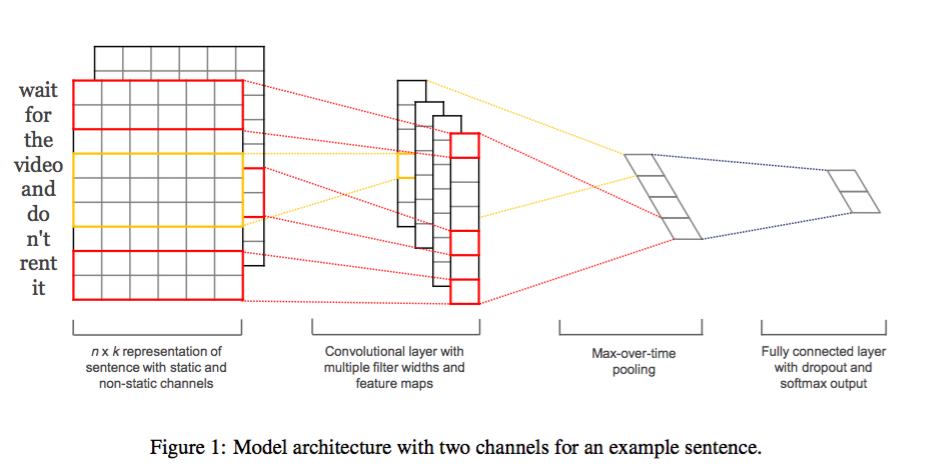
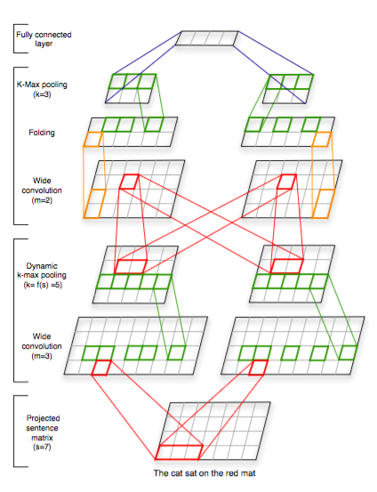

这周在做用CNN进行文本分类的工作, CNN比RNN训练时快很多, 更适用于GPU并行化计算, 所以看了一些CNN-based的论文, 了解一下在使用CNN做NLP问题时所采用的通用做法以及各自不同的做法. 而看的几篇文章的主要分歧其实是CNN的输入问题.

---
## Using general Embedding

[1](Kim, Y. 2014)这篇是Yoon Kim在2014年(EMNLP2014)的文章, 应该是比较经典的做法. 其框架如下

输入矩阵的每行是对应词的embedding, 用一个宽度为embedding维度的filter来做卷积, 这也是文本和图像做卷积不同的地方, 也就是文本只关注时间序列上的卷积,不关注单词特征各维度的关系. 文章中选用了高分别为3,4,5三种filter, 每个filter要做100个feature maps, 也就是经过卷积层后得到300个特征向量, 对这些向量分别做max-over-time pooling就得到一个300*1的向量, 然后将这个向量传入全连接层经过softmax就能得到分类的概率结果.
在训练上本文使用了SGD, 并对倒数第二层做了dropout.
这个模型非常的简洁, 直观, 没有太多的trick, 很有借鉴意义.
在这篇文章中, 作者在七个文本分类任务的数据集上做了实验, 结果表明这个很简单的框架就能够和其他复杂的模型相匹敌. 这证明word2vec的universal embedding对于文本分类任务很有用.
此外作者还研究了所谓non-static representation. 也就是对于embedding不只是作为输入, 而是作为可以训练的参数. 这样对于不同的任务, embedding会做出相应的调整, 事实上static和non-static的表示是作为不同channel输入的, 最终的结果显示non-static representation会带来一点性能的提升.
最后作者在和别人的工作[2](Kalchbrenner et al., 2014)对比后, 认为自己的结果比别人差不多的cnn更好的原因是用了更多不同大小的filter和更多的feature map
在Kalchbrenner的论文[2]里提出的Dynamic Convolutional Neural Network (DCNN), 使用了两层卷积, 并且采用了动态的k-max pooling.  

其实这个框架和Kim的框架在大多数任务上都互有胜负, 只是模型不够简洁. 而且filter size只用了一种.

---
## Using one-hot representation
在[3](Johnson & Zhang, 2015a)这篇论文中, 作者没有使用事先训练好的embedding作为输入, 而是就用高维的one-hot vectors. 这么做的动机就是想看看,CNN在没有引入embedding这种相当于外部资源的情况下, 性能如何, 同时也可以验证引入embedding的必要性. 毕竟CNN在计算机视觉领域就是直接对图像原始表示进行处理的.
这篇文章提出两种模型, 第一种seq-CNN将词汇表V中的每个词当做类似于RGB的channel, 只不过只能取0或1. 对于窗口为p的一个region(比如p=2是两个相邻的词),就得到一个p|V|的向量. 但是如果|V|太大的话, 那这个模型的参数就太多了. 所以在第二种模型bow-CNN中, 采用了类似于BOW的做法, 即一个region用BOW来表示, 那么就从P|V|变成了|V|的向量, 然后做卷积. Pooling层使用dynamic pooling, 比如把向量按位置划分几个部分, 每个部分单独做pooling, 这样可以获得位置信息.
在实验方面, 使用了IMDB, Elec: electronics product reviews, RCV1: topic categorization三个数据集, 前两个是关于sentiment, 后面一个是篇章级别的关于topic的分类. 对于sentiment
分类seq-CNN更好, 对于topic分类bow-CNN更好. 不过从文章的分析来看, 并不是因为这两种模型的差异. 而是因为, 在模型选择时, topic分类需要选择更大的region size, 而bow-CNN因为有更少的参数所以更适合于大的region size.
虽然本文方法超过了这些数据集上的state-of-art, 不过比较奇怪的事, 文中的base-line竟然是bag-of-n-grams的SVM. 在提到之前的CNN做法时, 文章说它们自己实现的Kim[1]的模型比他们的模型慢了几倍, 而且效果不好(没有给出具体数字), 从它们的描述来看, 我觉得作者可能对Yoon Kim的模型有些误解. 至于DCNN[2](Kalchbrenner et al., 2014), 文章给出了实验结果, 不如本文模型.
不过值得注意的是本文所采用的数据集都是长文本, 从短文本角度来讲, 还是使用了Embedding的方法效果更好, 至于如果是长文本和topic相关的, 那么可以尝试本文方法不用embedding. 尽管我个人认为本文的实验设置并没有验证embedding引入的必要性与否, 但是也证明了直接使用one-hot也可以做出很好的效果.

Rie Johnson & Tong Zhang后来又拓展了他们的模型发了新的文章[4](Johnson & Zhang, 2015b). 这篇文章的主要工作是"direct learning of embeddings of text regions":直接去学习卷积窗口内区域的表示. 既不是用BOW也不是用general的embedding(word2vec). 这种表示比word2vec更和任务相关.
具体来说这篇文章使用两个CNN, 一个用来学习区域的embedding, 另一个用来预测分类. 在学习embedding时, 优化的目标可以有两种策略, 一种是无监督的根据上下文来学习(类似于word2vec), 另一种是有监督的, 也就是用labeld的数据先训练了一个CNN, 再将中间的一层作为这个区域的表示.
本文实验和上一篇论文相同, 并且新的模型性能超越了之前的模型. 此外, 文章还花了相当的篇幅和Yoon Kim[1]的模型进行了对比, 不仅在实验结果上超过了Yoon Kim的模型, 而且作者认为, 使用word2vec丢失了one-hot表示的很多信息, 而且word2vec的embedding未必和任务相关, 且word2vec的embedding都是以词为单位的.
从这篇论文来看, 的确给人带来了除了直接使用word2vec和BOW以外的第三种思路, 也就是根据具体任务做embedding. 尽管Rie Johnson & Tong Zhang的实验证明这种做法效果很好, 但是如果不使用外部的大量数据能否训练出好的embedding是值得怀疑的, 尤其是对于小数据集而言. 关于NLP网络的输入表示还需要更多验证和思考.

Rie Johnson & Tong Zhang一年之后又发了一篇关于神经网络文本分类的文章, 不过是研究LSTM了.

---
## Other
关于CNN输入还有一部分是做char-level的CNN, 也就是对字母做卷积, 这样能够获得词形上的信息, 尤其是英语的前缀后缀现象. 这种做法更适用于大数据集, 在小数据集上效果不好. 因为对汉语帮助不大所以还没看. 比如Zhang, X., Zhao, J., & LeCun, Y. (2015). Character-level Convolutional Networks for Text Classification, 和Kim, Y., Jernite, Y., Sontag, D., & Rush, A. M. (2015). Character-Aware Neural Language Models.

---
## Practical Advice
[5](Zhang, Y et al., 2015)这篇论文通过实验来验证CNN在做文本分类时各种模型的性能优劣, 给出了一些用CNN做NLP实践上的指导. 结合我个人的经验总结如下:
* **input** : 对于小数据集和情感分析, 引入embedding是有必要的, word2vec普遍比GloVe更好, 而且将embedding作为参数一起训练会有稍微的提升. 对于长文本的问题, one-hot和char-level的方法可以尝试. 如果数据真的很充足, 那按照[Rie Johnson & Tong Zhang b]的做法重新学习一个task-specific embedding有可能是最好的.
* **filter size**: 同时选择多种size(三到四个), 而且这几个size要接近, 具体选择多少按问题而定, Topic问题应该大一点, 句子级别应该小一点, 对于句子级别, 1到10可以尝试, [3,4,5]可以当做base-line
* **feature map**: 不能太少, 比较少时越增加越好, 但到达临界值后就没有提升, 且再增加会难以训练. 具体要结合性能和训练难度决定. 几十到几百都可以尝试.
* **activation function**: 先试试Relu或者tanh
* **Pooling strategy**: max-pooling. 就取最大值, 尤其是位置不重要的任务.
* **regularization**: dropout(0.0-0.5)基本有用, l2 norm基本没用.
* **layers**: 现在基本都是使用一层的卷积, 更多层还没有太多研究.

---
## Last
在NLP任务中使用CNN, 其实有一点移花接木的感觉, 因为使用CNN不像RNN那样有一种直观上的可行性. CNN虽然在图像上取得了巨大成功, 这种成功可以得到一些动机上的解释, 比如CNN的卷积能够很好抓住图像中的边缘信息进而获得形状信息, 比如感受野理论. 但是图像的表示和语言的表示还是截然不同, 语言没有边缘也没有形状, 语言是由高度抽象的符号组成的. 尽管在NLP实用中CNN也取得不错的效果, 但没有动机的来源, 也得不到足够的解释.
此外, CNN在NLP还有一些新的做法, 比如用一些CV领域用的新的卷积方法(dilated), 也有人提出结合句法树结合词性信息, 比如把词性作为输入的一个channel. 等以后有机会再扩充吧.

---
## Reference
* [1]Kim, Y. (2014). Convolutional Neural Networks for Sentence Classification. Proceedings of the 2014 Conference on Empirical Methods in Natural Language Processing (EMNLP 2014), 1746–1751.
* [2]Kalchbrenner, N., Grefenstette, E., & Blunsom, P. (2014). A Convolutional Neural Network for Modelling Sentences. Acl, 655–665.
* [3]Johnson, R., & Zhang, T. (2015). Effective Use of Word Order for Text Categorization with Convolutional Neural Networks. To Appear: NAACL-2015, (2011).
* [4]Johnson, R., & Zhang, T. (2015). Semi-supervised Convolutional Neural Networks for Text Categorization via Region Embedding.
* [5]Zhang, Y., & Wallace, B. (2015). A Sensitivity Analysis of (and Practitioners’ Guide to) Convolutional Neural Networks for Sentence Classification,
